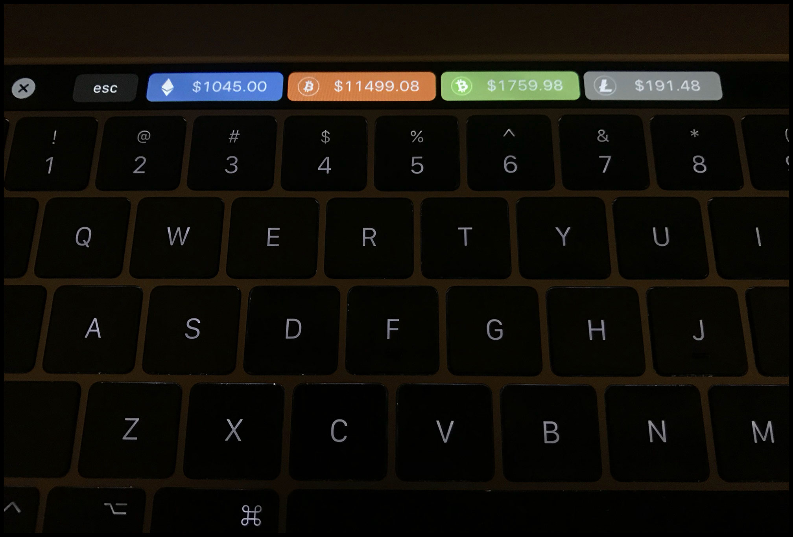

# GDAX-Touchbar
Display GDAX Crypto Prices on MacBook Pro touchbar

# DONATE
- ETH: _0xB80679fA7867a2a4aA727d15aD008661dd115F6D_
- BTC: _1Dq7zhbB9rXCJtuCsgh8pDuwc8Bwama1hf_
- BCH: _bitcoincash:qpnthu05cky4su33h56kf4d079znkz90pyj8aq9yqj_
- LTC: _LPvjpHxUHx7nU32ckzj9FXrDbji3sFChN7_

# INSTALLATION INSTRUCTIONS
1. Save [gdax-touchbar.json](https://raw.githubusercontent.com/djrosenbaum/GDAX-Touchbar/master/gdax-touchbar.json)

2. Download and Install [Better Touch Toolbar](https://www.boastr.net/downloads/)

3. Open Better Touch Toolbar Preferences

4. Navigate to the TouchBar Tab from the Better Touch Toolbar Navigation

5. Click Manage Presets from the lower left

6. Click Import and select gdax-touchbar.json

7. Click the Better Touch Toolbar icon on your touchbar to toggle Crypto Prices On and Off

# DESCRIPTION
This preset allows displaying crypto prices with the Better Touch Toolbar. Designed to display Coinbase GDAX Crypto prices on a Macbook Pro touchbar. Display Ether, Bitcoin Core, Bitcoin Cash, and Litecoin on your touchbar.

# SPECIAL THANKS
Special thanks to [Cryptodam.us](http://www.cryptodam.us/chat)
